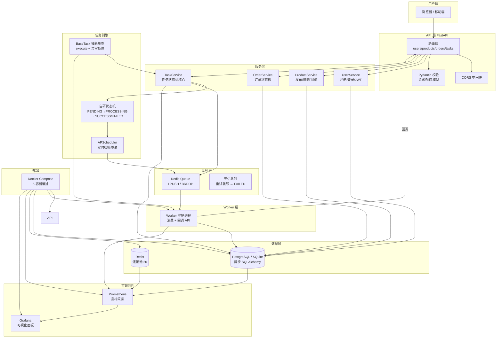

[English Version](./README_EN.md)

# 校园闲置流转助手

**自研生产级校园二手交易 + 智能匹配平台**  
从 n8n/Coze 低代码原型升级为全栈自研系统

---

## 🎬 演示视频

> 完整演示自研任务状态机：任务创建 → 入队 → Worker 消费 → 状态流转 → 失败重试 → 最终成功/失败

**[▶ 观看演示视频](./assets/demo-state-machine.mp4)**

| 演示内容 | 说明 |
|----------|------|
| 任务状态机 | `PENDING → PROCESSING → SUCCESS / FAILED`，含指数退避重试 |
| Redis 可靠队列 | LPUSH / BRPOP 异步消费，失败自动重入队 |
| 订单状态机 | 7 种订单状态完整流转闭环 |
| API 联调 | FastAPI 路由 + 任务回调验证 |

---

## 📋 项目总结（简历用）

### 项目概述

自研全栈校园二手交易平台，实现用户认证、物品发布/搜索、订单交易闭环，以及基于**自研任务状态机 + Redis 可靠队列 + APScheduler 重试调度**的异步任务引擎。核心亮点是**不依赖 Celery / 规则引擎**，用显式状态机 + 数据库持久化 + 定时自愈实现生产级可靠性。

### 面试核心卖点

| 卖点 | 说明 |
|------|------|
| **自研任务状态机** | 显式定义 `PENDING→PROCESSING→SUCCESS/FAILED`，非法跃迁拒绝；支持指数退避重试（最多 10 次）与 APScheduler 定时扫描自愈 |
| **可靠异步队列** | Redis List LPUSH/BRPOP + Worker 守护进程；失败重入队，重试耗尽进入 FAILED 终态 |
| **双状态机设计** | 任务状态机（异步引擎）+ 订单状态机（交易闭环）分离，职责清晰、可独立演进 |
| **全栈交易闭环** | JWT 注册/登录 → 物品 CRUD/搜索 → 订单 7 态流转，完整 REST API + 分页 |
| **可观测性** | Prometheus 指标 + Grafana 面板，覆盖 API / Worker / DB / Redis |
| **容器化部署** | Docker Compose 一键启动 6 服务（API + Worker + PG + Redis + Prometheus + Grafana） |
| **生产就绪** | 异步 SQLAlchemy 连接池、CORS、健康检查、生命周期钩子、SQLite/PG 双适配 |

### 为什么自研状态机？

- **可控**：每个状态跃迁在代码中显式定义，面试时可逐行讲解，比黑盒队列更体现工程深度
- **可测**：E2E 测试覆盖完整流转路径（见 `test_state_machine_e2e.py`）
- **可扩展**：新增任务类型只需继承 `BaseTask`，状态机逻辑零改动
- **可交付**：失败重试、死信、定时自愈——对标远程自动化/后端岗位的生产级要求

---

## 🏗️ 项目架构



---

## 🔄 核心状态机流转

### 任务状态机

```
                    ┌─────────────┐
                    │   PENDING   │ ◄──── 创建任务 / 重试入队
                    └──────┬──────┘
                           │ claim
                           ▼
                    ┌─────────────┐
              ┌──── │  PROCESSING │
              │     └──────┬──────┘
              │            │
         ┌────┴────┐ ┌────┴────┐
         │ SUCCESS │ │  FAILED │ ← 重试次数 < max_retries → PENDING
         └─────────┘ └─────────┘   重试次数 ≥ max_retries → FAILED（最终）
                            │
                      ┌─────┴─────┐
                      │ CANCELLED │ ← 任意状态可取消
                      └───────────┘
```

### 订单状态机

```
PENDING → PAID → SHIPPED → COMPLETED
    │        │        │
    └→ CANCELLED  REFUNDING → REFUNDED
```

---

## 🚀 快速启动

### 本地开发（SQLite）

```powershell
cd campus-idle-fullstack
.\venv\Scripts\activate
uvicorn main:app --reload
```

访问：http://localhost:8000

### Docker 生产部署（PostgreSQL + Redis + 全组件）

```powershell
cd campus-idle-fullstack
docker compose up -d --build
```

访问：
- API: http://localhost:8000
- Prometheus: http://localhost:9090
- Grafana: http://localhost:3000 (admin/admin)

---

## 📁 项目结构

```
campus-idle-fullstack/
├── main.py                    # FastAPI 入口 + 任务状态机 API
├── app/
│   ├── api/v1/                # 路由层
│   │   ├── users.py           #   用户注册/登录/资料
│   │   ├── products.py        #   物品发布/搜索/管理
│   │   └── orders.py          #   订单创建/状态流转
│   ├── core/
│   │   ├── config.py          #   全局配置（pydantic-settings）
│   │   ├── database.py        #   异步 SQLAlchemy 引擎
│   │   └── redis.py           #   Redis 连接池 + 队列实现
│   ├── models/
│   │   ├── base.py            #   ORM 基类 + 时间戳混入
│   │   ├── user.py            #   用户模型（角色/状态枚举）
│   │   ├── product.py         #   物品模型（分类/状态枚举）
│   │   ├── order.py           #   订单模型（7 种状态）
│   │   └── task.py            #   任务模型（状态机核心）
│   ├── schemas/               # Pydantic 请求/响应模型
│   ├── services/              # 业务逻辑层
│   │   ├── user_service.py
│   │   ├── product_service.py
│   │   ├── order_service.py
│   │   └── task_service.py    #   状态机核心服务
│   └── tasks/
│       └── base.py            #   BaseTask 抽象基类
├── backend/
│   └── worker.py              # Worker 守护进程
├── Dockerfile                 # 多阶段构建
├── docker-compose.yml         # 6 容器编排
├── prometheus.yml             # 监控配置
├── README.md
└── README_EN.md
```

---

## 🛠️ 技术栈

| 层级 | 技术 | 用途 |
|------|------|------|
| **框架** | FastAPI + Uvicorn | 异步 Web 框架 |
| **ORM** | SQLAlchemy 2.0 (async) | 数据库操作 |
| **校验** | Pydantic v2 | 请求/响应模型 |
| **数据库** | PostgreSQL / SQLite | 生产/开发 |
| **缓存/队列** | Redis (asyncio) | 任务队列 + 连接池 |
| **任务调度** | APScheduler | 重试定时扫描 |
| **认证** | python-jose (JWT) | 用户认证 |
| **密码** | passlib (bcrypt) | 密码哈希 |
| **Worker** | 自研守护进程 | 异步消费任务 |
| **监控** | Prometheus + Grafana | 指标采集 + 可视化 |
| **部署** | Docker Compose | 容器编排 |

---

## 📊 API 端点一览

### 用户管理 `/users`

| 方法 | 路径 | 说明 |
|------|------|------|
| POST | `/users/register` | 注册（自动签发 JWT） |
| POST | `/users/login` | 登录 |
| GET | `/users/{id}` | 查询用户 |
| PATCH | `/users/{id}` | 更新资料 |
| POST | `/users/{id}/change-password` | 修改密码 |
| GET | `/users` | 用户列表（分页） |

### 物品管理 `/products`

| 方法 | 路径 | 说明 |
|------|------|------|
| POST | `/products` | 发布物品 |
| GET | `/products/search` | 搜索/筛选（关键词/分类/价格/分页） |
| GET | `/products/{id}` | 查看详情（自动增加浏览） |
| PATCH | `/products/{id}` | 更新物品 |
| DELETE | `/products/{id}` | 软删除 |
| GET | `/products/seller/{id}` | 卖家物品列表 |

### 订单管理 `/orders`

| 方法 | 路径 | 说明 |
|------|------|------|
| POST | `/orders` | 创建订单（自动快照 + 改物品状态） |
| GET | `/orders/search` | 搜索/筛选 |
| GET | `/orders/{id}` | 查看详情 |
| PATCH | `/orders/{id}` | 更新状态（状态机流转） |
| POST | `/orders/{id}/cancel` | 取消订单（恢复物品） |
| GET | `/orders/buyer/{id}` | 买家订单列表 |
| GET | `/orders/seller/{id}` | 卖家订单列表 |
| GET | `/orders/stats/count/{status}` | 按状态统计 |

### 任务状态机 `/api/v1/tasks`

| 方法 | 路径 | 说明 |
|------|------|------|
| GET | `/api/v1/tasks` | 列出所有任务 |
| POST | `/api/v1/tasks` | 创建任务（→ PENDING） |
| POST | `/api/v1/tasks/{id}/claim` | 领取任务（→ PROCESSING） |
| POST | `/api/v1/tasks/{id}/complete` | 完成任务（→ SUCCESS） |
| POST | `/api/v1/tasks/{id}/fail` | 失败（触发重试或 → FAILED） |
| POST | `/api/v1/tasks/{id}/cancel` | 取消任务（→ CANCELLED） |

---

## 🔧 核心设计亮点

### 1. 自研任务状态机

- 完整生命周期：`PENDING → PROCESSING → SUCCESS/FAILED/CANCELLED`
- **指数退避重试**：`delay × 2^(attempt-1)`，最大 10 次
- **APScheduler 自愈**：每 30 秒扫描到期重试任务，自动重新入队
- **CAS 领取**：仅 PENDING 状态可领取，防止重复消费

### 2. 可靠异步队列

- **Redis List**：LPUSH 入队 / BRPOP 阻塞出队
- **静默降级**：Redis 不可用时任务仍可创建（本地开发友好）
- **死信处理**：重试耗尽后自动标记 FAILED

### 3. 全栈交易闭环

- 用户 → 物品 → 订单，完整 CRUD
- 订单创建时自动**快照**物品标题/价格
- 订单状态变更自动**同步**物品状态（下单→RESERVED，取消→ACTIVE）

### 4. 可观测性

- Prometheus 采集 5 个 Job：API、Worker、PostgreSQL、Redis、Docker
- Grafana 预配置数据源，开箱即用

---

## 📝 开发计划

- [x] Phase 1: 项目骨架 + 数据模型
- [x] Phase 2: 任务状态机 + Redis 队列 + Worker
- [x] Phase 3: 用户/物品/订单全栈 CRUD
- [x] Phase 4: Docker Compose + Prometheus + Grafana
- [ ] Phase 5: 智能匹配算法
- [ ] Phase 6: 前端界面
