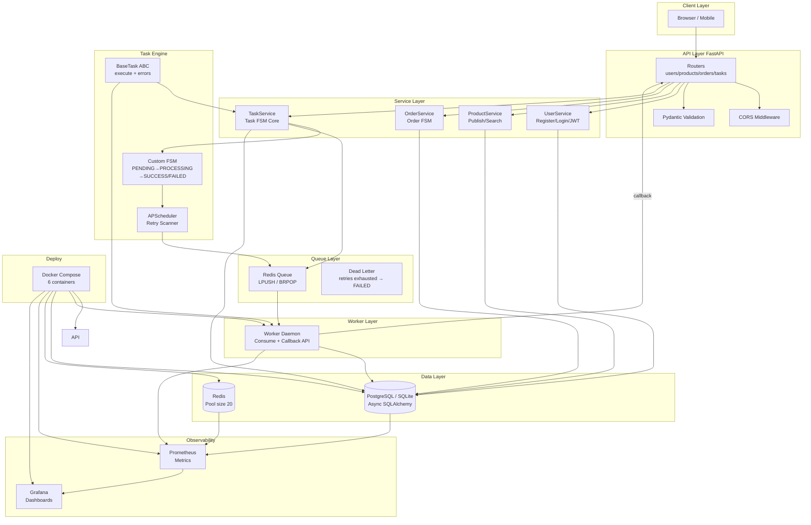

[中文版本](./README.md)

# Campus Idle Exchange Platform

**Production-grade campus marketplace with intelligent matching**  
Evolved from n8n/Coze low-code prototypes into a self-built Python full-stack system

---

## 🎬 Demo Video

> Full walkthrough of the custom task state machine: create → enqueue → consume → transition → retry → terminal state

**[▶ Watch Demo](./assets/demo-state-machine.mp4)**

| Demo Coverage | Description |
|---------------|-------------|
| Task FSM | `PENDING → PROCESSING → SUCCESS / FAILED` with exponential backoff |
| Reliable Redis Queue | LPUSH / BRPOP async consume; failed tasks re-enqueued |
| Order FSM | Full 7-state order lifecycle |
| API Integration | FastAPI routes + task callback verification |

---

## 📋 Project Summary (Resume)

### Overview

A self-built full-stack campus marketplace with JWT auth, product listing/search, order lifecycle, and an async task engine powered by a **custom task state machine**, **Redis reliable queue**, and **APScheduler retry scheduler** — without Celery or external rule engines. State transitions are explicit, persisted, and self-healing.

### Interview Highlights

| Highlight | Description |
|-----------|-------------|
| **Custom Task FSM** | Explicit `PENDING→PROCESSING→SUCCESS/FAILED`; illegal transitions rejected; exponential backoff (max 10 retries) + scheduled self-healing |
| **Reliable Async Queue** | Redis List LPUSH/BRPOP + worker daemon; re-enqueue on failure; FAILED terminal state on exhaustion |
| **Dual State Machines** | Task FSM (async engine) + Order FSM (trade flow) decoupled for clear ownership |
| **Full Trade Loop** | JWT auth → product CRUD/search → 7-state order flow with paginated REST APIs |
| **Observability** | Prometheus metrics + Grafana dashboards for API, worker, DB, Redis |
| **Containerized** | One-command Docker Compose with 6 services |
| **Production-ready** | Async SQLAlchemy pool, CORS, health checks, lifespan hooks, SQLite/PostgreSQL |

### Why a Custom State Machine?

- **Controllable**: Every transition is explicit in code — easy to walk through in interviews vs. black-box queues
- **Testable**: E2E tests cover full transition paths (`test_state_machine_e2e.py`)
- **Extensible**: New task types inherit `BaseTask` without changing FSM core logic
- **Deliverable**: Retry, dead-letter, and scheduled recovery meet production bar for remote backend/automation roles

---

## 🏗️ Architecture



---

## 🔄 State Machine Flows

### Task State Machine

```
                    ┌─────────────┐
                    │   PENDING   │ ◄──── create / retry enqueue
                    └──────┬──────┘
                           │ claim
                           ▼
                    ┌─────────────┐
              ┌──── │  PROCESSING │
              │     └──────┬──────┘
              │            │
         ┌────┴────┐ ┌────┴────┐
         │ SUCCESS │ │  FAILED │ ← retries < max → PENDING
         └─────────┘ └─────────┘   retries ≥ max → FAILED (terminal)
                            │
                      ┌─────┴─────┐
                      │ CANCELLED │ ← cancellable from any state
                      └───────────┘
```

### Order State Machine

```
PENDING → PAID → SHIPPED → COMPLETED
    │        │        │
    └→ CANCELLED  REFUNDING → REFUNDED
```

---

## 🚀 Quick Start

### Local Development (SQLite)

```powershell
cd campus-idle-fullstack
.\venv\Scripts\activate
uvicorn main:app --reload
```

Open: http://localhost:8000

### Docker Production (PostgreSQL + Redis + Full Stack)

```powershell
cd campus-idle-fullstack
docker compose up -d --build
```

Services:
- API: http://localhost:8000
- Prometheus: http://localhost:9090
- Grafana: http://localhost:3000 (admin/admin)

---

## 📁 Project Structure

```
campus-idle-fullstack/
├── main.py                    # FastAPI entry + task FSM APIs
├── app/
│   ├── api/v1/                # Route layer
│   │   ├── users.py
│   │   ├── products.py
│   │   └── orders.py
│   ├── core/
│   │   ├── config.py
│   │   ├── database.py
│   │   └── redis.py
│   ├── models/
│   │   ├── base.py
│   │   ├── user.py
│   │   ├── product.py
│   │   ├── order.py
│   │   └── task.py
│   ├── schemas/
│   ├── services/
│   │   ├── user_service.py
│   │   ├── product_service.py
│   │   ├── order_service.py
│   │   └── task_service.py
│   └── tasks/
│       └── base.py
├── backend/
│   └── worker.py
├── Dockerfile
├── docker-compose.yml
├── prometheus.yml
├── README.md
└── README_EN.md
```

---

## 🛠️ Tech Stack

| Layer | Technology | Purpose |
|-------|------------|---------|
| **Framework** | FastAPI + Uvicorn | Async web framework |
| **ORM** | SQLAlchemy 2.0 (async) | Database access |
| **Validation** | Pydantic v2 | Request/response models |
| **Database** | PostgreSQL / SQLite | Prod / Dev |
| **Cache / Queue** | Redis (asyncio) | Task queue + connection pool |
| **Scheduling** | APScheduler | Retry scan schedule |
| **Auth** | python-jose (JWT) | User authentication |
| **Password** | passlib (bcrypt) | Password hashing |
| **Worker** | Custom daemon | Async task consumer |
| **Monitoring** | Prometheus + Grafana | Metrics + dashboards |
| **Deploy** | Docker Compose | Container orchestration |

---

## 📊 API Endpoints

### Users `/users`

| Method | Path | Description |
|--------|------|-------------|
| POST | `/users/register` | Register (auto-issue JWT) |
| POST | `/users/login` | Login |
| GET | `/users/{id}` | Get user |
| PATCH | `/users/{id}` | Update profile |
| POST | `/users/{id}/change-password` | Change password |
| GET | `/users` | List users (paginated) |

### Products `/products`

| Method | Path | Description |
|--------|------|-------------|
| POST | `/products` | Publish product |
| GET | `/products/search` | Search/filter |
| GET | `/products/{id}` | Detail (+ view count) |
| PATCH | `/products/{id}` | Update product |
| DELETE | `/products/{id}` | Soft delete |
| GET | `/products/seller/{id}` | Seller's listings |

### Orders `/orders`

| Method | Path | Description |
|--------|------|-------------|
| POST | `/orders` | Create order (snapshot + product status) |
| GET | `/orders/search` | Search/filter |
| GET | `/orders/{id}` | Order detail |
| PATCH | `/orders/{id}` | Update status (FSM) |
| POST | `/orders/{id}/cancel` | Cancel (restore product) |
| GET | `/orders/buyer/{id}` | Buyer orders |
| GET | `/orders/seller/{id}` | Seller orders |
| GET | `/orders/stats/count/{status}` | Count by status |

### Task State Machine `/api/v1/tasks`

| Method | Path | Description |
|--------|------|-------------|
| GET | `/api/v1/tasks` | List tasks |
| POST | `/api/v1/tasks` | Create (→ PENDING) |
| POST | `/api/v1/tasks/{id}/claim` | Claim (→ PROCESSING) |
| POST | `/api/v1/tasks/{id}/complete` | Complete (→ SUCCESS) |
| POST | `/api/v1/tasks/{id}/fail` | Fail (retry or → FAILED) |
| POST | `/api/v1/tasks/{id}/cancel` | Cancel (→ CANCELLED) |

---

## 🔧 Design Highlights

### 1. Custom Task State Machine

- Lifecycle: `PENDING → PROCESSING → SUCCESS/FAILED/CANCELLED`
- **Exponential backoff**: `delay × 2^(attempt-1)`, max 10 attempts
- **APScheduler self-healing**: scan due retries every 30s and re-enqueue
- **CAS claim**: only PENDING can be claimed (prevent duplicate consume)

### 2. Reliable Async Queue

- **Redis List**: LPUSH in / BRPOP out
- **Graceful degrade**: tasks still creatable when Redis is down (dev-friendly)
- **Dead letter**: auto-mark FAILED when retries exhausted

### 3. Full Trade Loop

- User → Product → Order end-to-end CRUD
- Auto **snapshot** of title/price on order create
- Order status changes **sync** product status (order → RESERVED, cancel → ACTIVE)

### 4. Observability

- Prometheus scrapes 5 jobs: API, Worker, PostgreSQL, Redis, Docker
- Grafana datasource preconfigured

---

## 📝 Roadmap

- [x] Phase 1: Skeleton + data models
- [x] Phase 2: Task FSM + Redis queue + Worker
- [x] Phase 3: Users / Products / Orders CRUD
- [x] Phase 4: Docker Compose + Prometheus + Grafana
- [ ] Phase 5: Intelligent matching
- [ ] Phase 6: Frontend UI
